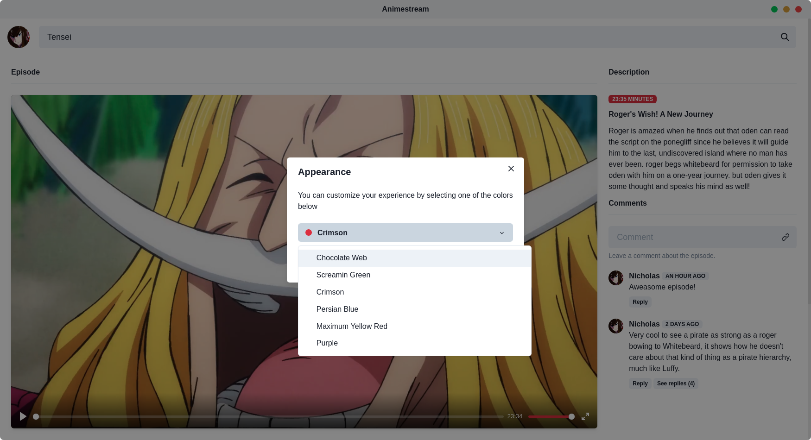
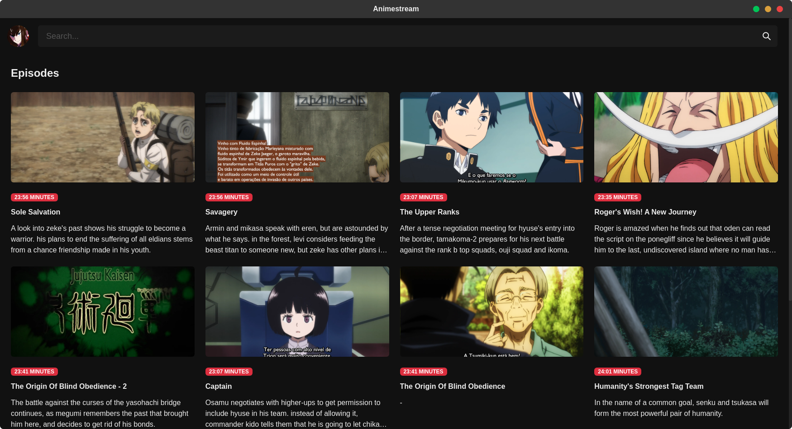
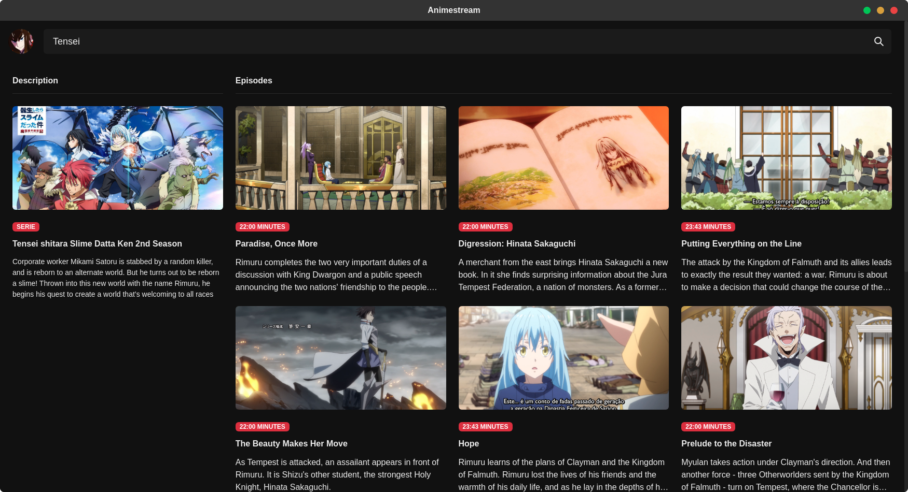
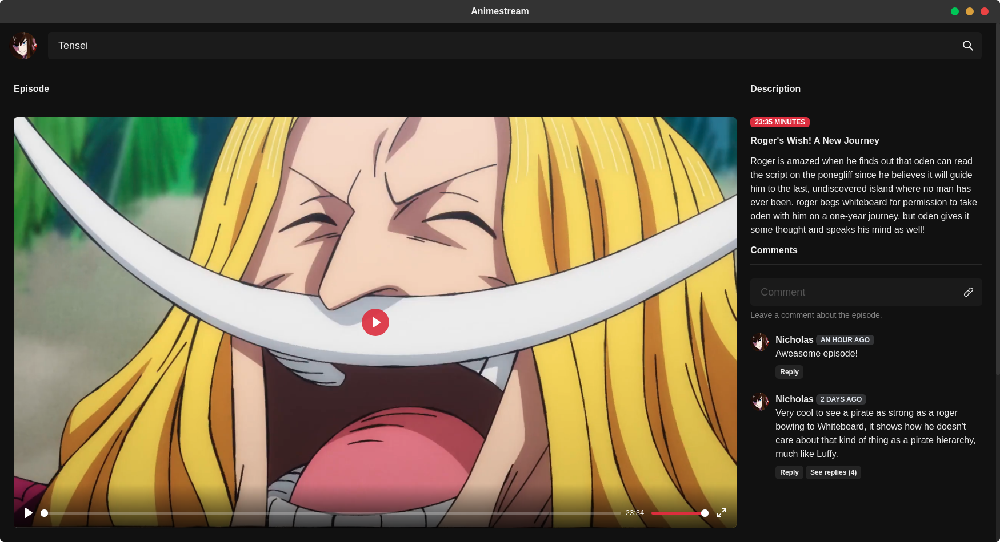

```
░█▀▀█ ▒█▄░▒█ ▀█▀ ▒█▀▄▀█ ▒█▀▀▀ ▒█▀▀▀█ ▀▀█▀▀ ▒█▀▀█ ▒█▀▀▀ ░█▀▀█ ▒█▀▄▀█
▒█▄▄█ ▒█▒█▒█ ▒█░ ▒█▒█▒█ ▒█▀▀▀ ░▀▀▀▄▄ ░▒█░░ ▒█▄▄▀ ▒█▀▀▀ ▒█▄▄█ ▒█▒█▒█
▒█░▒█ ▒█░░▀█ ▄█▄ ▒█░░▒█ ▒█▄▄▄ ▒█▄▄▄█ ░▒█░░ ▒█░▒█ ▒█▄▄▄ ▒█░▒█ ▒█░░▒█
```

Watch your favorite series

# Get started

A desktop application that allows you to watch your favorite series, save your progress and share your thoughts through comments.

# Requirements

| Name     | Version    | Description                                                                                        |
| -------- | ---------- | -------------------------------------------------------------------------------------------------- |
| Electron | ^11.2.3    | Framework used to make desktop applications with HTML, Javascript and CSS.                         |
| React    | ^16.13.1   | React is an open source JavaScript library focused on creating user interfaces on web pages        |
| NodeJS   | >= 10.14.2 | Node.js is open source, multiplatform software that executes JavaScript code on the backend/server |

# Structure

All modules have their own folder inside src and inside their folders, there is the following structure:

```
/components // Unitary components like Inputs, Buttons, etc...
/routes
/store // Redux files
/entities
/collections
/utils
/services // Http or external things like LocalStorage or WebSocket.
```

# Theming

You can switch between light and dark themes and select the main color of the application.



# Images

### Home



### Search


### Serie



### Episode


